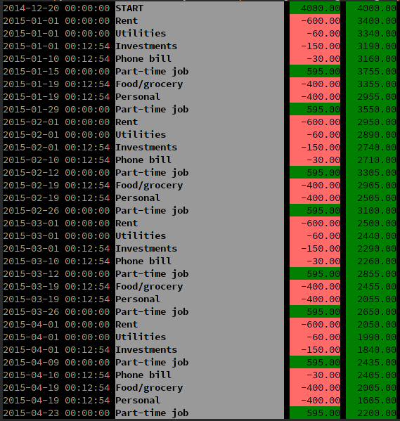

BUDGET-O-MATIC
==============

Balance the books, programmer style.

I made this for my own use since spreadsheets just don't do the things I want them to in any reasonably simple way.

**THE COOL PART**: Specify new items in a really cool way:

    s.register("every week from jan 7 to aug 19", (-2000, "You are terrible at personal finance"))

Write out your time periods in words rather than learning some weird new syntax! The supported inputs are quite diverse; check out the [Recurrent](https://github.com/kvh/recurrent) library to see some more examples.

How to use
----------

Download [this repository](https://github.com/Uberi/budget-o-matic/archive/master.zip).

All dependencies are already included. You don't need Pip, you don't need Virtualenv, nothing but plain old Python 3.

Edit `budget.py` to specify your start time, end time, and budget entries.

When done editing, run `budget.py` using Python 3. It will print out a nice summary like the one you see in the screenshot above.
